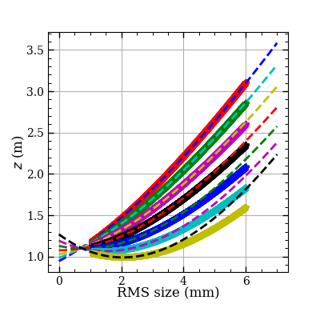
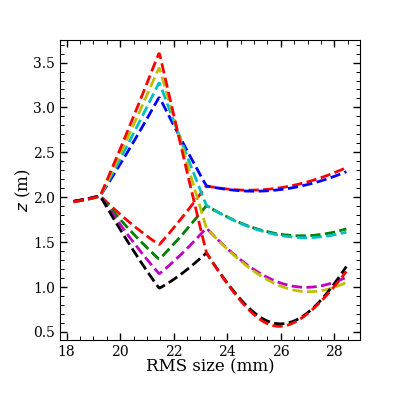
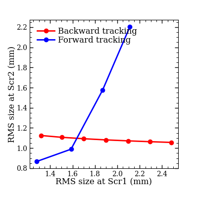

# Transport the beam with `THz-2nC-booster-to-undulator.py`

This script has defined quadrupole gradients from EMSY1 to undulator for 2 nC, one can try to run it to get familiar with `Ocelot`.

The input `Astra` beam can be found from [here](https://syncandshare.desy.de/index.php/s/kR7WsQPQSa8FbgB)


# Tuning of quadupole strengths

- `DoubletTuning.py`, give the strength of the first quadrupole and tune the second one in order to get a round beam downstream at a defined position.
- `TripletTuning.py`, give the strength of the first quadrupole, tune the second and third quadrupoles for a round beam transport downstream
- `QuadrupletTuning.py`, give the strength of the first and second quadrupoles, tune the third and fourth for a round beam transport downstream

# Find matching condition with the script `THzMatching2025.py`

**Precondtion**

One has simulated forward and backward tracking with two quaduople triplets and saved results in two folders. In each folder, there is one file recording the quadrupole settings.

The corresponding folder and file names in the script should be mofidied accordingly.

**Output**

After running the script, one expects three plots:





They show the transport of beam in the backward and forward directions and the matching condition, respectively. There should be intersection in the right plot, which is the maching condition.

There will also be output for the quadrupole setting:
```
Forward triplet:  [ 0.34114393 -0.66300435  0.50075709]
Backward triplet in forward order:  [ 1.37506771 -3.13222557  1.81512167]
```
